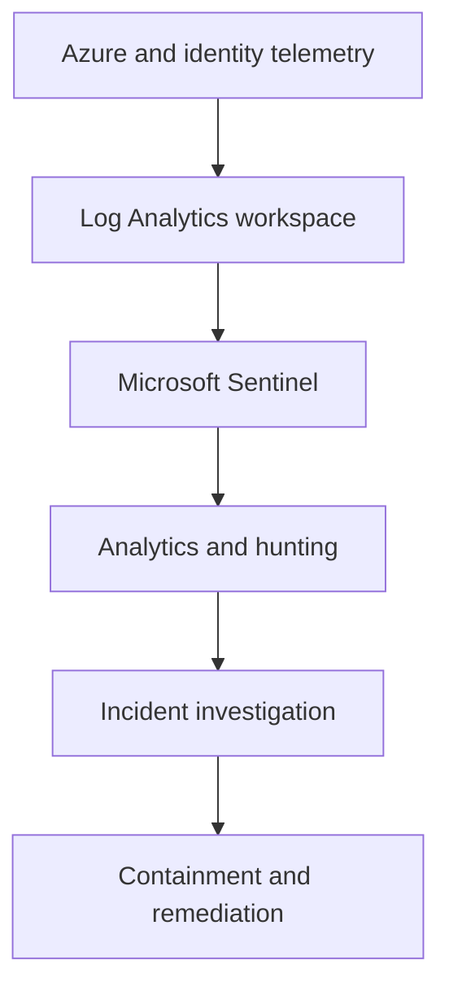
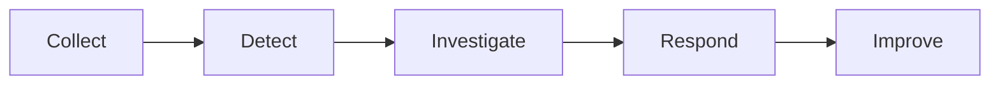

# NorthStar Azure Security Operations

**Microsoft Sentinel, KQL Detection Engineering, Threat Hunting, and Incident Response Portfolio**


## Project Overview

This project develops an enterprise-oriented security-operations capability for the fictional NorthStar organization.

It extends the NorthStar infrastructure, identity, and DevSecOps portfolio with centralized monitoring, KQL detection engineering, threat hunting, incident triage, MITRE ATT&CK mapping, response procedures, and security automation.

The project separates implemented controls from planned capabilities and does not represent simulated incidents as employer production experience.

## Verified Sentinel Controls

The NorthStar environment includes an enabled Microsoft Sentinel workspace, Fusion, and two verified scheduled analytics rules covering failed Azure control-plane operations and Application Gateway WAF matches.

[View the live validation record](docs/sentinel-live-validation.md)

## Objectives

- Design a Microsoft Sentinel and Log Analytics monitoring architecture
- Create reusable KQL analytics and hunting queries
- Map detections to MITRE ATT&CK techniques
- Simulate and investigate controlled security events
- Document incident triage, containment, remediation, and recovery
- Develop automation and SOAR concepts
- Preserve sanitized validation evidence
- Apply protected GitHub delivery controls to detection content

## Current Implementation Status

NorthStar currently includes verified Microsoft Sentinel analytics controls, live aggregate telemetry validation, MITRE-mapped KQL hunting content, a sanitized incident-triage exercise, and an approval-gated response-playbook design.

[View the implementation and validation matrix](docs/completion-matrix.md)

## Planned Architecture



## Security-Operations Workflow



## Delivery Roadmap

| Stage | Outcome | Status |
|---|---|---|
| Foundation | Repository, architecture, evidence controls, incident templates, and protected GitHub workflow | Complete |
| Telemetry | Log Analytics, Sentinel, AzureActivity, and Application Gateway WAF telemetry | Verified |
| Detection | Deployed analytics rules and authored KQL detection content | Verified |
| Threat hunting | Two MITRE-mapped KQL hunts with aggregate validation | Verified |
| Incident response | Sanitized triage exercise and manual response playbook | Demonstrated |
| Automation | Approval-gated Sentinel and Logic App SOAR design | Documented; deployment planned |
| Validation | Live telemetry and protected-PR validation evidence | Verified |

## Repository Structure

```text
northstar-azure-security-operations/
├── analytics/
│   ├── detections/
│   └── hunting/
├── docs/
│   └── diagrams/
├── evidence/
│   └── screenshots/
├── incidents/
├── playbooks/
└── README.md
```

## Visual Evidence

The evidence gallery records enabled Sentinel analytics controls, sanitized live telemetry validation, and the protected GitHub delivery gate.

[View the visual evidence gallery](evidence/README.md)

## Evidence Integrity

The repository will not publish tenant IDs, subscription IDs, workspace IDs, object IDs, credentials, tokens, personal user information, public IP addresses, or reusable authentication material.

Screenshots and command output must be cropped or sanitized before publication.

## Cost Control

Azure services will be introduced deliberately. Architecture, KQL content, incident templates, and test datasets will be prepared before enabling paid ingestion or retention.

## Relationship to NorthStar

This project adds security monitoring and incident response to the existing NorthStar infrastructure, Identity and Zero Trust, and secure DevSecOps portfolio projects.

## Scope

NorthStar is controlled portfolio and lab work, not employer production experience.
