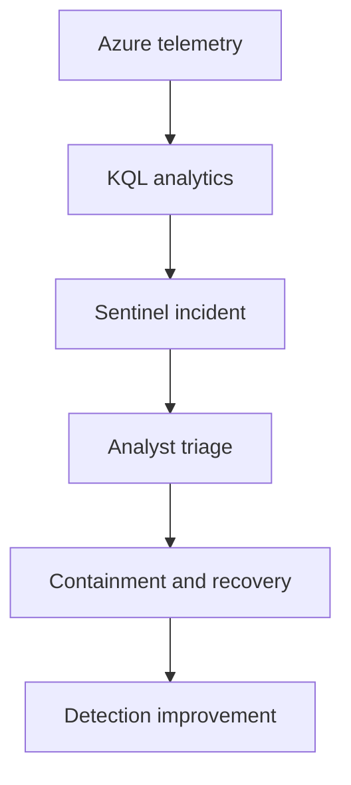

# Security Operations Flow

```mermaid
flowchart TD
    Telemetry["Azure telemetry"] --> Analytics["KQL analytics"]
    Analytics --> Incident["Sentinel incident"]
    Incident --> Triage["Analyst triage"]
    Triage --> Response["Containment and recovery"]
    Response --> Improvement["Detection improvement"]
```
