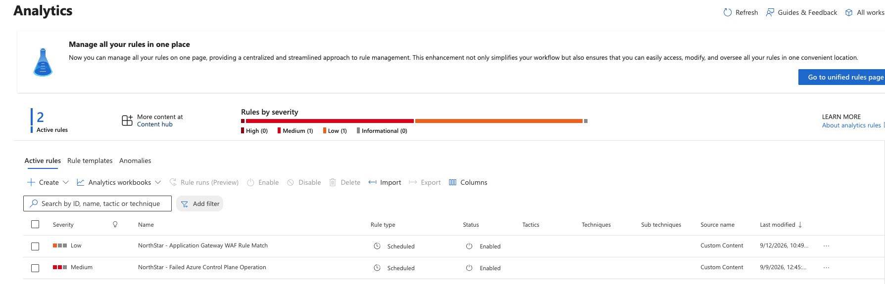
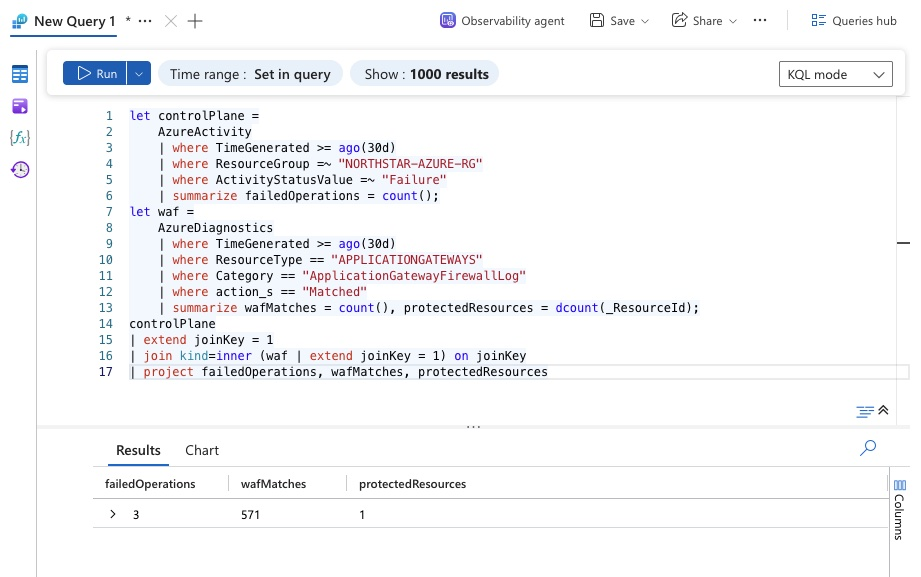
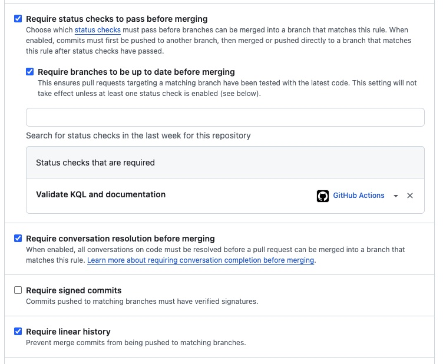

# Evidence Register

Evidence must demonstrate implemented controls without exposing tenant IDs, subscription IDs, workspace IDs, object IDs, credentials, tokens, personal data, or public IP addresses.

Screenshots must be cropped and sanitized before publication. Simulated evidence must be clearly labeled.

## Evidence Manifest

| File | Demonstrates | Source |
|---|---|---|
| `01-sentinel-analytics-rules.jpg` | Two enabled NorthStar scheduled analytics rules with Low and Medium severities | Microsoft Sentinel Analytics |
| `02-sentinel-telemetry-validation.jpg` | Sanitized aggregate validation: 3 failed control-plane events, 571 WAF matches, and 1 protected resource | Log Analytics |
| `03-github-protected-gate.jpg` | Required KQL/documentation validation, strict synchronization, conversation resolution, and linear history | GitHub branch protection |

## Evidence Gallery

### Sentinel Analytics Rules

### Sanitized Telemetry Validation

### Protected Delivery Gate

